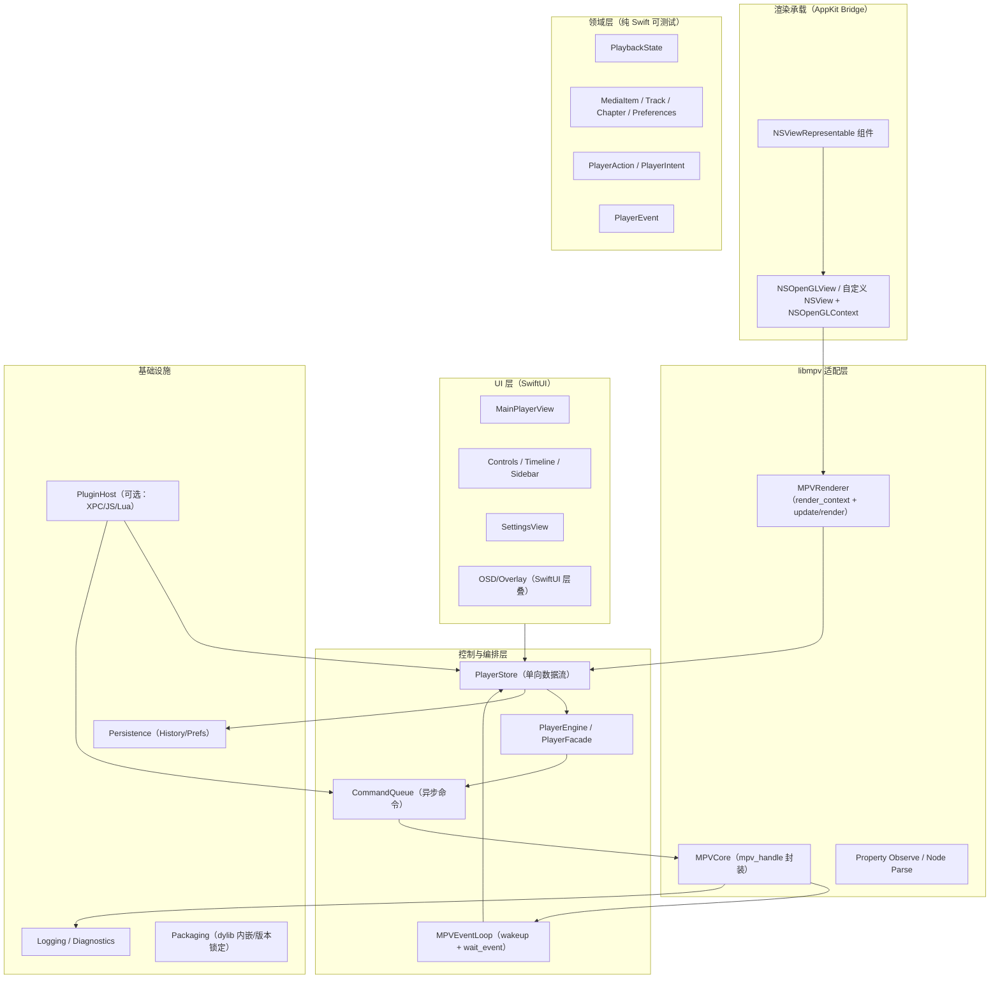
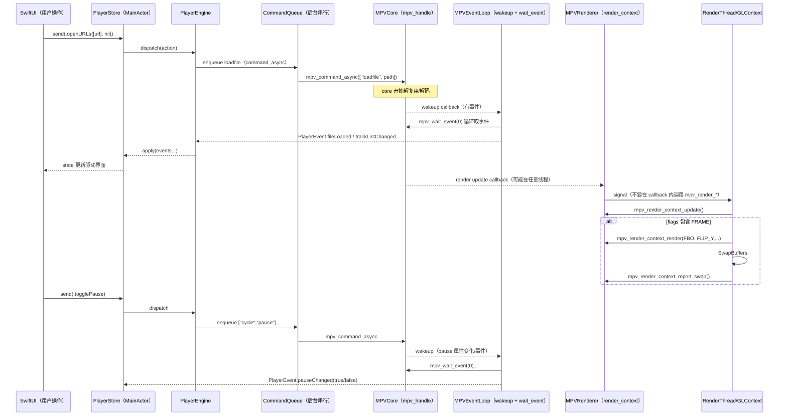
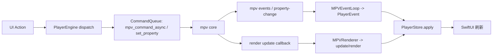

# 面向 macOS 的开源播放器调研与基于 libmpv + Swift 的可落地详细设计方案

## 执行摘要

本报告面向**具备 macOS/Swift 开发经验、希望自定义并长期维护播放器项目**的工程师，给出从选型到工程落地的全链路方案，默认目标 **macOS 13+、Xcode 最新稳定版、优先 Apple Silicon（可选 universal）**。核心结论是：**以 libmpv 为播放内核、SwiftUI 做业务 UI、关键视频渲染区用 AppKit（NSViewRepresentable）桥接**，并以 libmpv 的**Render API（render.h + render_gl.h）**作为首选渲染方案。mpv 官方明确推荐将 mpv 作为库嵌入到其他程序，并指出推荐方式是使用 **libmpv**。citeturn21view0turn9view0

关于“Metal 渲染”的现实约束需要提前澄清：**mpv 官方的 libmpv Render API 在 render.h 中只定义了 OpenGL 与软件渲染（SW）后端**，并未提供官方 Metal 后端类型；同时 render_gl.h 也围绕 OpenGL 上下文（macOS 需要 CGL）做约束。因此，“render_gl/metal”在“官方 render API”层面**目前只能可靠落地 render_gl（OpenGL）**；如果你强需求 Metal（例如统一 Metal 渲染管线、或强依赖 CAMetalLayer/MTKView），建议将 Metal 作为“后续演进/实验分支”，或采用“窗口嵌入 + mpv 自管 VO”/“AVFoundation 混用”等备选路径（见后文渲染章节）。citeturn7view3turn8view0turn12search3

工程化层面，本方案强调三条落地原则：  
第一，**单向数据流**：UI → Action → Engine → libmpv（异步命令）→ Event/Property → State → UI。mpv 的 client API 以“命令/属性/事件”为中心，事件循环通过 mpv_wait_event 与 mpv_set_wakeup_callback 可与 GUI 事件循环集成。citeturn9view0  
第二，**渲染线程隔离**：render.h 强烈建议渲染与普通 libmpv 调用分离，否则可能死锁；启用 MPV_RENDER_PARAM_ADVANCED_CONTROL 后，必须在 update callback 触发后尽快调用 mpv_render_context_update，并严格遵守“回调中不调用 mpv API”等限制。citeturn4view0turn18view3turn17view0  
第三，**依赖与发布可复现**：参考 IINA 的工程实践，将 libmpv 与依赖（ffmpeg/libass 等）作为可版本化工件下载/构建，并在 Xcode 中通过 Copy Dylibs、Link Binary 等阶段内嵌；IINA 也明确提示“头文件版本必须与 dylib 匹配”。citeturn19view0

---

## 选型与对比：开源播放器生态与内核评估

从“可二次开发/可维护/可跨平台”的角度，开源播放器与内核大致分三类：  
其一，**以 mpv 为核心的播放器/前端**：例如 IINA（macOS 现代播放器，Powered by mpv），以及 Linux 上的 Celluloid（GTK 前端，明确通过 libmpv client API 与 mpv 交互）。citeturn11search3turn12search1turn19view0  
其二，**VLC 生态**：VLC 本体跨平台，开发侧以 **libVLC** 为核心（VideoLAN 官方标注为 LGPL2.1，并提供包含 Apple 平台绑定 VLCKit 等多种 binding）。citeturn2search3turn0search5turn2search6  
其三，**媒体中心类**：Kodi 属于“媒体中心/客厅体验”方向，项目复杂度与二次开发学习成本更高（更适合做“媒体中心产品”而非轻量播放器）。citeturn12search0turn12search4

### 内核能力对比表

| 维度 | libmpv（mpv） | libVLC（VLC） | AVFoundation（Apple 原生） |
|---|---|---|---|
| 定位 | 播放器内核（以命令/属性/事件为中心），可嵌入 | 多媒体框架/播放引擎，生态成熟 | Apple 平台原生媒体框架 |
| API 形态 | C API：命令、属性、事件；推荐 libmpv 嵌入citeturn21view0turn9view0 | C API/多语言绑定；官方强调引擎 LGPLv2+ 便于嵌入citeturn2search6turn2search3 | ObjC/Swift API；系统级集成强 |
| 渲染嵌入 | Render API 推荐；官方 Render API 后端为 OpenGL/SW（无官方 Metal）citeturn7view3turn8view0 | 常用“设置输出窗口/视图”的方式（不同绑定各异）citeturn0search5turn2search3 | AVPlayerLayer/AVSampleBufferDisplayLayer 等，高度系统化 |
| 字幕/滤镜/画质调参 | mpv 以“参数化 + 脚本”著称，手册完整citeturn1search12turn9view0 | 功能全面但 API/模块更“重量级” | 可做但受系统 API 约束；高级渲染/滤镜链灵活性较有限 |
| 硬解与播放性能 | render_gl.h 明确硬件解码可支持，但依赖图形/上下文条件（macOS 需 CGL）citeturn8view0 | 生态成熟、跨平台硬解经验丰富 | Apple 平台通常最“省心”，对系统硬解路径支持好 |
| 许可与合规风险 | **关键点**：client API 头文件采用 ISC 便于封装，但 mpv core 默认 GPLv2+；可用 -Dgpl=false 构建为 LGPLv2+（需你自行构建链路与合规确认）citeturn9view0 | libVLC 官方标注 LGPL2.1；VLC 仓库亦说明引擎 LGPLv2+ 以便第三方嵌入citeturn2search3turn2search6 | 无开源许可负担，但仅限 Apple 平台、闭源依赖 |
| 打包复杂度 | 最高：需内嵌 libmpv + 依赖 dylib，并处理 install_name/@rpath、签名、公证citeturn19view0turn10search1 | 中等：依赖及插件体系较大，但有 VLCKit 等分发方式citeturn0search5turn2search3 | 最低：系统自带框架，无第三方 dylib 内嵌 |
| 可扩展性 | 高：参数、脚本、事件驱动；IINA 还在其上构建 JavaScript 插件系统citeturn19view0turn3search24 | 中高：可做大量扩展，但工程体量大 | 中：扩展通常走 Apple 推荐路径 |

### 结论性选型建议

若你的目标是“高度可定制播放器、长期迭代、跨平台可能性更高”，则优先 **libmpv**；若你更看重“许可更友好、跨平台分发与 API 包装更现成”，可备选 **libVLC**；若你强需求“与系统媒体栈深度绑定（DRM、系统级播放体验、AirPlay 等）”，可考虑 **AVFoundation 为主**或与 libmpv 混用。mpv 官方也强调：libmpv 本质上暴露的是 mpv 的命令接口，Options/Commands/Properties 是主要交互方式。citeturn9view0turn21view0

---

## 架构概览与模块关系

### 项目假设

本方案在未指定项上做以下假设并继续推进：  
应用最低支持 macOS 13（Ventura）及以上；默认支持 Apple Silicon，建议发布时提供 **universal（arm64 + x86_64）**；分发渠道优先“独立分发（Developer ID + Notarization）”，也预留 Mac App Store 适配空间（但注意沙盒与第三方 dylib 的限制会更严格）。Apple 官方明确 notarization 流程与 notarytool/stapler，并强调 notarization 是自动化扫描与签名检查，不等同 App Review。citeturn10search1turn10search3

### 模块关系图（mermaid）



### 架构行动项

建议你从 Day 1 就把工程拆成“可独立测试的 Domain + 可替换的 Engine + 封装良好的 MPVBridge”，并坚持：UI 不直接调用 C API。mpv client API 的交互可以完全通过命令/属性/事件完成；渲染则走 render.h/render_gl.h。citeturn9view0turn7view3turn8view0

---

## 模块设计、接口定义与数据模型

本章给出**可直接照着实现**的接口与数据结构（尽量接近可编译 Swift；个别地方用伪代码强调设计意图）。

### 核心原则：单向数据流 + 双通道事件

mpv 的世界里有两类“信号源”：  
其一，**player event（mpv_wait_event）**：文件加载、日志、错误、轨道变化等；其二，**render update callback**：提醒你需要调用 mpv_render_context_update，再决定是否渲染下一帧。render.h 明确：update callback 不能直接调用 mpv API；如果启用 ADVANCED_CONTROL，则 update callback 之后调用 mpv_render_context_update 是硬性要求。citeturn18view3turn4view0

因此建议把它们拆为：  
**MPVEventLoop（处理 mpv_wait_event）** 与 **MPVRenderer（处理 render update/render）** 两条通道，最终都汇聚成你自己的 PlayerEvent。

### 数据模型

```swift
import Foundation

struct MediaItem: Identifiable, Hashable, Codable {
    let id: UUID
    let url: URL
    var title: String
    var duration: TimeInterval?   // from mpv "duration"
    var lastPosition: TimeInterval?
    var addedAt: Date
}

struct Track: Identifiable, Hashable, Codable {
    enum Kind: String, Codable { case video, audio, subtitle }
    let id: Int                 // mpv track id
    let kind: Kind
    var title: String?
    var lang: String?
    var codec: String?
    var isSelected: Bool
    var isExternal: Bool
}

struct Chapter: Identifiable, Hashable, Codable {
    let id: Int
    var title: String?
    var startTime: TimeInterval
}

struct PlayerPreferences: Codable, Hashable {
    var defaultVolume: Double = 60
    var rememberPosition: Bool = true
    var hwdec: String = "auto-safe" // 推荐做成可配置项
    var mpvConfigDir: URL? = nil    // 若启用 mpv config，建议显式设置 config-dir
}
```

mpv 的 Options/Commands/Properties 文档在 mpv 手册中，client.h/libmpv.rst 也明确了这些是核心交互方式。citeturn9view0turn21view0turn1search12

### 运行时状态

```swift
import Foundation

struct PlaybackState: Equatable {
    var current: MediaItem? = nil
    var playlist: [MediaItem] = []
    var isPaused: Bool = true
    var isBuffering: Bool = false
    var position: TimeInterval = 0
    var duration: TimeInterval = 0
    var volume: Double = 60
    var speed: Double = 1.0
    var isFullscreen: Bool = false

    var videoTracks: [Track] = []
    var audioTracks: [Track] = []
    var subtitleTracks: [Track] = []
    var chapters: [Chapter] = []

    var lastError: String? = nil
}
```

### Action / Event 定义

```swift
import Foundation

enum PlayerAction: Equatable {
    case openURLs([URL], startIndex: Int?)
    case play
    case pause
    case togglePause
    case seekAbsolute(TimeInterval)
    case seekRelative(TimeInterval)
    case setVolume(Double)
    case setSpeed(Double)
    case selectTrack(kind: Track.Kind, id: Int)
    case screenshot(to: URL)
    case toggleFullscreen
}

enum PlayerEvent: Equatable {
    // 来自 mpv 事件/属性
    case fileLoaded(url: URL?)
    case pauseChanged(Bool)
    case timePosChanged(TimeInterval)
    case durationChanged(TimeInterval)
    case trackListChanged([Track])
    case chapterListChanged([Chapter])
    case log(String)
    case error(String)

    // 来自渲染通道（一般 UI 不一定需要，但调试/诊断有用）
    case renderRequested
}
```

### Engine 协议与 Store（关键类）

```swift
import SwiftUI

protocol PlayerControlling {
    func dispatch(_ action: PlayerAction)
}

@MainActor
final class PlayerStore: ObservableObject {
    @Published private(set) var state = PlaybackState()

    private let engine: PlayerControlling

    init(engine: PlayerControlling) { self.engine = engine }

    func send(_ action: PlayerAction) {
        engine.dispatch(action)   // 只发动作，不直接碰 mpv
    }

    func apply(_ event: PlayerEvent) {
        switch event {
        case .pauseChanged(let p): state.isPaused = p
        case .timePosChanged(let t): state.position = t
        case .durationChanged(let d): state.duration = d
        case .error(let msg): state.lastError = msg
        case .trackListChanged(let tracks):
            state.videoTracks = tracks.filter { $0.kind == .video }
            state.audioTracks = tracks.filter { $0.kind == .audio }
            state.subtitleTracks = tracks.filter { $0.kind == .subtitle }
        case .chapterListChanged(let chapters): state.chapters = chapters
        default: break
        }
    }
}
```

### MPVCore：C API 封装边界

这里的目标是：你所有 `mpv_*` 调用都收敛到一个地方，避免 SwiftUI/业务层散落 C 细节。mpv client API 的机制（命令/属性/事件、mpv_set_wakeup_callback、mpv_wait_event 等）在 client.h 中写得非常明确。citeturn9view0

```swift
import Foundation

final class MPVCore {
    typealias Handle = OpaquePointer
    private(set) var handle: Handle?

    // 事件回调由 MPVEventLoop 转成结构化事件后再抛给上层
    init?() {
        // libmpv 要求 LC_NUMERIC= "C"，否则可能失败；建议在 App 启动最早阶段设置
        // （client.h 的 “Basic environment requirements” 明确写了这一点）citeturn9view0
        guard let h = mpv_create() else { return nil }
        self.handle = h
    }

    deinit {
        if let h = handle { mpv_terminate_destroy(h) }
    }

    func setOption(_ key: String, _ value: String) {
        guard let h = handle else { return }
        mpv_set_option_string(h, key, value)
    }

    func initialize() throws {
        guard let h = handle else { throw NSError(domain: "mpv", code: -1) }
        let r = mpv_initialize(h)
        if r < 0 { throw NSError(domain: "mpv", code: Int(r)) }
    }

    func commandAsync(_ args: [String], userdata: UInt64 = 0) {
        guard let h = handle else { return }
        // 这里略去 Swift->C 数组构建细节，可实现一个安全的 withCStringArray 工具
        // 注意：启用 ADVANCED_CONTROL 时，render 线程永远不能阻塞 core，
        // 因而应优先使用 mpv_command_async（mpv-examples sdl/main.c 注释也强调了这一点）citeturn17view0turn18view3
    }

    func observeProperty(_ name: String, format: mpv_format) {
        guard let h = handle else { return }
        mpv_observe_property(h, 0, name, format)
    }
}
```

### 许可与合规边界（必须落到工程决策）

mpv 的 client API 头文件采用 ISC 许可，便于第三方封装；但同一份 client.h 也明确提醒：**mpv core 默认仍是 GPLv2+，除非用 -Dgpl=false 构建为 LGPLv2+**。这会直接影响你项目是否能闭源、以及分发时的合规要求。citeturn9view0  
行动项：在项目立项时就确定“是否接受 GPL（开源你的应用）”，或建立“自建 mpv（-Dgpl=false）+ 合规审查”的持续流程。

---

## 事件与状态流：从用户操作到 mpv 再到渲染

### 关键约束回顾

1) mpv 事件：推荐用 mpv_set_wakeup_callback 将事件接入 GUI 事件循环，并在被唤醒后用 mpv_wait_event(0) 抽干队列；不调用 mpv_wait_event 不会停止播放，但会让事件队列拥塞。citeturn9view0  
2) render update callback：render.h 明确 **回调内不能调用任何 mpv API**；启用 ADVANCED_CONTROL 后，必须在回调触发后尽快调用 mpv_render_context_update 并解读返回 flags。citeturn18view3turn4view0  
3) render.h 强烈建议渲染与普通 libmpv 调用分离，否则可能死锁；并提示若你需要特定 VO（例如 libmpv rendering API），必须显式指定。citeturn4view0turn20view0

### UI ↔ MPV ↔ Renderer 时序图（mermaid）

下面以“打开文件并播放 + 暂停 + seek”为例，展示双通道（事件通道/渲染通道）如何汇聚到 Store。



### 状态流图（mermaid）



---

## 渲染接入详细方案

本章给出**可直接照着实现的渲染步骤**，并解释“OpenGL render API（可落地）”与“Metal（现状与替代方案）”。

### render API 与 window embedding 的选择

mpv-examples README 将“嵌入视频”分为两种方式：  
**Native window embedding（wid）** 与 **Render API**。其中 Render API 让你创建 OpenGL 上下文，并在每帧调用 mpv_render_context_render；它更复杂但更灵活，允许你在视频之上做自定义叠层；并且该 README 明确指出由于平台问题（尤其 OS X），Render API 通常更推荐。citeturn13view0  
render.h 也再次强调：相比窗口嵌入，**推荐使用 render API**，因为窗口嵌入在 GUI toolkit/平台上会有各种问题。citeturn4view0  
此外 opengl-cb API 已被标记为 deprecated，且 mpv-examples 指出旧 API 在 mpv 0.33.0 起已失效/停用，应使用 render.h。citeturn13view0

### macOS + OpenGL（render_gl）落地步骤

下面步骤综合了 render.h/render_gl.h 规范与 mpv-examples 的 SDL 与 Cocoa 示例（尤其是 ADVANCED_CONTROL + update/render 流程、以及 get_proc_address 的实现方式）。citeturn17view0turn15view0turn18view3turn8view0

#### 关键步骤清单

**步骤一：App 启动尽早设置 LC_NUMERIC**  
client.h 明确要求 LC_NUMERIC 必须为 "C"。Swift 中可在 @main 的初始化最早阶段调用 `setlocale(LC_NUMERIC, "C")`。citeturn9view0

**步骤二：创建 mpv 实例并设置关键 option（在 initialize 前）**  
- 强制 `vo=libmpv`（vo.rst 强调如需特定 VO（libmpv rendering API）必须显式指定）。citeturn20view0turn17view0  
- 开启日志（开发期）：`mpv_request_log_messages`  
- 根据需要设置 `hwdec`（render_gl.h 说明 render API 可支持硬件解码，但 macOS 需要 CGL 环境，且通过设置 "hwdec" property 可随时切换）。citeturn8view0  
- 是否加载 mpv 配置：client.h 说明 libmpv 默认不加载 config；自 libmpv 1.15 可重新启用，但强烈建议同时设置 config-dir，否则会加载命令行 mpv 的配置。citeturn9view0

**步骤三：建立 OpenGL 上下文（NSOpenGLContext/NSOpenGLView）并保证线程一致性**  
render_gl.h 说明 OpenGL context 由 API 使用方控制线程；所有 mpv_render_* 调用都隐式使用该 OpenGL context。citeturn8view0  
实践建议：把“GLContext current + mpv_render_context_update/render/report_swap”固定在单一 render queue/thread。

**步骤四：实现 get_proc_address（macOS 用 CFBundleGetFunctionPointerForName）**  
mpv-examples 的 cocoa-rendergl 示例在 macOS 上用 `CFBundleGetFunctionPointerForName(CFBundleGetBundleWithIdentifier("com.apple.opengl"), symbolName)` 来解析符号。citeturn15view0  
render_gl.h 也明确：mpv 通过 get_proc_address 回调获取函数指针，通常不会自行加载系统 OpenGL 库。citeturn8view0

**步骤五：创建 mpv_render_context 并启用 ADVANCED_CONTROL**  
- `MPV_RENDER_PARAM_API_TYPE = MPV_RENDER_API_TYPE_OPENGL`  
- `MPV_RENDER_PARAM_OPENGL_INIT_PARAMS = mpv_opengl_init_params { get_proc_address }`  
- `MPV_RENDER_PARAM_ADVANCED_CONTROL = 1`（render.h 文档将其描述为“更好控制并启用高级特性”，并列出严格线程要求；SDL 示例也解释了启用后必须使用异步命令防止阻塞）。citeturn18view3turn17view0

**步骤六：设置 render update callback，并在回调中只做“唤醒/信号”**  
render.h：回调中不能调用 mpv API；回调可在任意线程触发，因此需线程安全地唤醒你的 render loop。citeturn18view3turn4view0

**步骤七：render loop：update → render → swap → report_swap**  
- 收到“需要渲染”的信号后，render thread 调用 `mpv_render_context_update()`，若 flags 包含 `MPV_RENDER_UPDATE_FRAME` 则调用 `mpv_render_context_render()`。citeturn18view3turn17view0  
- render 参数：`MPV_RENDER_PARAM_OPENGL_FBO`（默认 framebuffer=0；或自建 FBO）与 `MPV_RENDER_PARAM_FLIP_Y`（默认 framebuffer 通常需要 flip）。在 cocoa-rendergl 与 sdl 示例中都使用了 FLIP_Y=1。citeturn15view0turn17view0  
- 交换缓冲后调用 `mpv_render_context_report_swap()` 以改善 timing（render.h 明确该函数可选但有助于更好时序，且不要不一致使用）。citeturn18view3

#### Swift 侧伪代码（可直接改成可编译实现）

下面用“渲染线程固定 + 信号量唤醒”的方式表达 render pipeline（重点在结构，不纠结 Swift/C 指针细节）。

```swift
final class MPVRenderer {
    private let mpv: MPVCore
    private var renderCtx: OpaquePointer? // mpv_render_context*
    private let renderQueue = DispatchQueue(label: "render.queue", qos: .userInteractive)
    private let wakeSemaphore = DispatchSemaphore(value: 0)

    // 由 NSOpenGLView/Context 提供：makeCurrent(), swapBuffers()
    private unowned let glHost: GLHost

    init?(mpv: MPVCore, glHost: GLHost) {
        self.mpv = mpv
        self.glHost = glHost
        try? setupRenderContext()
        startLoop()
    }

    private func setupRenderContext() throws {
        glHost.makeCurrent()

        var initParams = mpv_opengl_init_params(
            get_proc_address: { ctx, name in
                // macOS: CFBundleGetFunctionPointerForName("com.apple.opengl")
                // 参考 mpv-examples cocoa-rendergl.m citeturn15view0
                return resolveOpenGLSymbol(name)
            },
            get_proc_address_ctx: nil
        )

        var adv: Int32 = 1

        var params: [mpv_render_param] = [
            mpv_render_param(type: MPV_RENDER_PARAM_API_TYPE, data: UnsafeMutableRawPointer(mutating: MPV_RENDER_API_TYPE_OPENGL)),
            mpv_render_param(type: MPV_RENDER_PARAM_OPENGL_INIT_PARAMS, data: &initParams),
            mpv_render_param(type: MPV_RENDER_PARAM_ADVANCED_CONTROL, data: &adv),
            mpv_render_param(type: MPV_RENDER_PARAM_INVALID, data: nil)
        ]

        // mpv_render_context_create(&renderCtx, mpv.handle, &params[0])
        // render.h：创建 render context 必须在播放/创建 VO 之前完成，并且要在 mpv core 销毁前 free citeturn4view0turn18view3

        // 设置 update callback：回调中仅 signal（不能调用 mpv API）citeturn18view3
        mpv_render_context_set_update_callback(renderCtx, { cbCtx in
            let this = Unmanaged<MPVRenderer>.fromOpaque(cbCtx!).takeUnretainedValue()
            this.wakeSemaphore.signal()
        }, Unmanaged.passUnretained(self).toOpaque())
    }

    private func startLoop() {
        renderQueue.async { [weak self] in
            guard let self else { return }
            while true {
                self.wakeSemaphore.wait()

                self.glHost.makeCurrent()

                let flags = mpv_render_context_update(self.renderCtx)
                if (flags & UInt64(MPV_RENDER_UPDATE_FRAME)) != 0 {
                    self.renderOneFrame()
                }
            }
        }
    }

    private func renderOneFrame() {
        let pixelSize = glHost.drawablePixelSize // 注意 Retina：用 backing pixels
        var fbo = mpv_opengl_fbo(fbo: 0, w: Int32(pixelSize.width), h: Int32(pixelSize.height), internal_format: 0)
        var flip: Int32 = 1

        var params: [mpv_render_param] = [
            mpv_render_param(type: MPV_RENDER_PARAM_OPENGL_FBO, data: &fbo),
            mpv_render_param(type: MPV_RENDER_PARAM_FLIP_Y, data: &flip),
            mpv_render_param(type: MPV_RENDER_PARAM_INVALID, data: nil)
        ]

        mpv_render_context_render(renderCtx, &params)
        glHost.swapBuffers()
        mpv_render_context_report_swap(renderCtx) // render.h 建议：可改善 timing citeturn18view3
    }
}
```

#### SwiftUI + AppKit bridge 的关键落地方式

- 视频区域必须是 `NSViewRepresentable`，返回一个自定义 `NSOpenGLView`（或一个含 NSOpenGLContext 的 NSView）。  
- 控制栏、侧边栏、弹窗、OSD 叠层用 SwiftUI。Render API 模式下 mpv 不会自动接管输入，你的交互应由 SwiftUI/Engine 自己处理；如果你需要把鼠标/按键“投喂”给 mpv（例如让 mpv 的某些命令按键生效），mpv-examples README 指出你需要用 `mouse/keypress/keydown/keyup` 等命令模拟输入。citeturn13view0

### Metal：现状、可行替代与何时混用 AVFoundation

#### 现状结论

- 官方 render.h 只提供 `MPV_RENDER_API_TYPE_OPENGL` 与 `MPV_RENDER_API_TYPE_SW` 的 API_TYPE 常量定义，并明确“Supported backends”为 OpenGL 与 Software。citeturn7view3turn4view0  
- render_gl.h 也以 OpenGL 上下文为核心，并指出 macOS 需要 CGL 环境（CGLGetCurrentContext 非空）。citeturn8view0  
- 第三方项目 MPVKit 明确提示：Metal 支持“仅为补丁版本，尚未官方支持，遇到问题不奇怪”。这意味着如果你要 metal，需要承担“维护补丁/跟随上游变更”的工程成本与风险。citeturn12search3

#### 可行替代路径（按推荐顺序）

1) **继续使用 render_gl（OpenGL）作为主线**，在 SwiftUI 上叠加自己的 OSD/控件。这是“最接近官方契约、可持续维护”的路线。citeturn8view0turn18view3  
2) **窗口嵌入（wid）作为 fallback**：当你遇到 OpenGL 兼容性/驱动问题时，可提供 wid 模式作为降级；mpv-examples README 建议在可能情况下支持两种方式。citeturn13view0turn4view0  
3) **AVFoundation 混用或替代**：当播放内容强依赖系统能力（例如强 DRM/系统级集成）、或你需要完整 Metal 渲染管线（CAMetalLayer/MTKView）时，可用 AVFoundation 负责该类媒体播放，mpv 负责本地/非 DRM 高级可调播放。Apple 官方建议使用 CAMetalLayer（或更高层的 MTKView）进行 Metal 渲染承载。citeturn6search3turn5search7  
4) **实验分支：基于补丁/第三方封装进行 Metal 探索**（风险较高，建议仅在架构已稳定后做）。

---

## 构建、依赖管理、打包发布与 CI/CD

### 目录结构与构建配置（建议落地形态）

建议单仓库多模块（Xcode workspace 或单工程多 group），保持 Domain/Engine 与 UI/MPVBridge 解耦：

```text
PlayerApp/
  App/
  UI/                # SwiftUI Views
  Domain/            # 纯 Swift，XCTest 友好
  Engine/            # Store/Reducer/Facade
  MPVBridge/         # libmpv 封装 + Renderer
    Headers/         # client.h render.h render_gl.h
    ThirdParty/      # 下载/构建产物（可选）
  Infrastructure/
    Persistence/
    Logging/
    PluginHost/
  Scripts/
    fetch_mpv.sh
    fix_install_names.sh
    sign_and_notarize.sh
  .github/workflows/macos.yml
```

### 依赖管理策略（强烈建议参考 IINA 的做法）

IINA 的构建说明给出了一套可复现的实践：  
- 可以运行脚本下载**预编译的 universal dylib**；也可选择 arm64/x86_64；并提醒如果构建旧版本需要下载匹配版本的 dylib。citeturn19view0  
- 若自行构建 mpv：IINA 建议通过包管理器（Homebrew tap / MacPorts）带正确 flags 构建，并强调“头文件版本要与 dylib 相同”；并提供脚本将依赖库部署到 deps/lib、再在 Xcode 的 Copy Dylibs/Link 阶段引用。citeturn19view0

落地行动项（推荐你照做）：
- 建一个 `Scripts/fetch_mpv.sh`，下载你锁定版本的 `libmpv.dylib + 依赖 dylib + headers` 到 `MPVBridge/ThirdParty/<version>/`。
- 建一个 `Scripts/verify_mpv_version.sh`，在 CI 中校验“headers 与 dylib 的版本一致”（避免运行时崩溃/ABI 差异）。
- 选择是否启用 mpv config：若启用，显式设置 `config-dir`，避免加载命令行 mpv 的用户配置（client.h 的建议）。citeturn9view0

### dylib 内嵌（App Bundle）要点

在 Xcode Target 中：
- `Build Phases -> Link Binary With Libraries`：链接 libmpv 与依赖 dylib。  
- `Build Phases -> Copy Files`：Destination 选 `Frameworks`，把 dylib 复制到 `YourApp.app/Contents/Frameworks/`。IINA 也明确要求把 dylib 加入 “Copy Dylibs” phase。citeturn19view0  
- 设置运行时搜索路径：`@executable_path/../Frameworks`（常用）或 `@rpath`。

建议你提供一个诊断脚本（示例）：

```bash
# Scripts/check_dylibs.sh
APP="build/Release/PlayerApp.app"
BIN="$APP/Contents/MacOS/PlayerApp"

echo "== otool -L =="
otool -L "$BIN"

echo "== frameworks =="
ls -al "$APP/Contents/Frameworks"
```

### 签名与公证（codesign + notarytool + stapler）

Apple 官方文档明确：notarytool 与 stapler（Xcode 内置）可上传软件到 Apple notary service 并将 ticket staple 到可执行文件；notary service 会扫描恶意内容并检查代码签名问题。citeturn10search1  
如果你启用 Hardened Runtime，Apple 官方也提示它会限制一些能力（例如 JIT）；如确有需要，需要添加 entitlement 放开个别限制。citeturn10search0  
notary service 可接受的容器包括 disk image、签名 pkg、zip 等，并能处理嵌套容器。citeturn1search3

#### 建议发布流程（独立分发）

1) **生成 Release 构建**（Archive 或 xcodebuild archive）  
2) **对 app bundle 内所有可执行内容签名**（二进制、framework、dylib、XPC、helper）  
3) **签名主 app（带 Hardened Runtime）**  
4) **打包为 zip 或 dmg**  
5) **notarytool submit**并等待结果  
6) **stapler staple**把 ticket 写入包内  
7) **spctl 验证 Gatekeeper**

示例命令（可放入 `Scripts/sign_and_notarize.sh`）：

```bash
set -euo pipefail

APP="PlayerApp.app"
IDENTITY_APP="Developer ID Application: YOUR NAME (TEAMID)"

# 1) 先签名内嵌 dylib（建议显式签，避免 --deep 误伤）
find "$APP/Contents/Frameworks" -type f \( -name "*.dylib" -o -name "*.framework" \) -print0 \
  | xargs -0 -I{} codesign --force --sign "$IDENTITY_APP" --options runtime --timestamp "{}"

# 2) 签名主 app（Hardened Runtime）
codesign --force --sign "$IDENTITY_APP" --options runtime --timestamp "$APP"

# 3) 验证签名
codesign --verify --verbose=3 "$APP"
spctl -a -vv "$APP"

# 4) 打包
ditto -c -k --keepParent "$APP" "PlayerApp.zip"

# 5) 公证（需要事先 notarytool store-credentials）
xcrun notarytool submit "PlayerApp.zip" --keychain-profile "notary-profile" --wait

# 6) staple
xcrun stapler staple "$APP"
```

说明：具体证书与凭证管理（store-credentials、Apple ID、team-id 等）属于通用 macOS 分发工作流；Apple 官方文档强调 notarytool/stapler 的使用方式与迁移建议。citeturn10search1turn10search3

### CI/CD（GitHub Actions 示例）

目标：在 PR 上做构建与测试；在 tag/release 上产出归档与工件；如你愿意在 CI 做签名公证，则需要在 GitHub Secrets 中存储 Developer ID 证书与 notarytool 凭证（建议最初只做“未签名构建 + 单元测试 + 静态检查”，签名/公证放到手工发布或受保护分支）。

示例 `.github/workflows/macos.yml`：

```yaml
name: macOS CI

on:
  pull_request:
  push:
    branches: [ "main" ]
    tags: [ "v*" ]

jobs:
  build-test:
    runs-on: macos-latest
    steps:
      - uses: actions/checkout@v4

      - name: Select Xcode
        run: sudo xcode-select -s /Applications/Xcode.app

      - name: Fetch libmpv artifacts
        run: |
          chmod +x Scripts/fetch_mpv.sh
          Scripts/fetch_mpv.sh

      - name: Build
        run: |
          xcodebuild \
            -scheme PlayerApp \
            -configuration Release \
            -destination "platform=macOS" \
            build

      - name: Test
        run: |
          xcodebuild \
            -scheme PlayerApp \
            -configuration Debug \
            -destination "platform=macOS" \
            test

      - name: Archive (tag only)
        if: startsWith(github.ref, 'refs/tags/')
        run: |
          xcodebuild \
            -scheme PlayerApp \
            -configuration Release \
            -destination "platform=macOS" \
            -archivePath build/PlayerApp.xcarchive \
            archive

      - name: Upload artifacts
        if: startsWith(github.ref, 'refs/tags/')
        uses: actions/upload-artifact@v4
        with:
          name: PlayerApp-archive
          path: build/PlayerApp.xcarchive
```

行动项：在 CI 阶段引入“软件渲染（SW）模式的无窗口 smoke test”可以提升稳定性（render.h 提供 SW 后端，但也提醒它很慢，仅用于特定场景/测试更合适）。citeturn4view0

---

## 测试、性能与安全、插件与跨平台演进、风险与里程碑

### 测试计划（从 Day 1 就能落地）

建议以“可测试的 Domain/Reducer”为核心，把最难测的 libmpv 部分通过协议隔离。

**单元测试（XCTest）**：  
覆盖 Playlist/History/Preferences、Action→State 的 reducer（尤其是 seek/拖动进度条的节流策略）、错误映射、轨道列表解析等。

**集成测试（可选）**：  
- 用 MPVCore 的 mock 替代真实 libmpv，验证 PlayerEngine 的命令序列（例如 open→observe→play）。  
- 或在本机/自建 runner 上跑真实 libmpv 的“短播放 smoke test”（CI 的 macOS runner 未必适合做带 OpenGL 的渲染测试）。

**UI 测试（XCUITest）**：  
验证打开文件面板、播放/暂停按钮状态、全屏切换、设置页持久化等。

### 性能调优建议（与 mpv 契约强相关）

1) **渲染线程与命令线程严格隔离**：render.h 多处警告死锁风险，启用 ADVANCED_CONTROL 后违反规则会变成“致命问题”；SDL 示例也明确启用后应优先使用异步命令，避免 render thread 阻塞。citeturn18view3turn17view0  
2) **高 DPI 尺寸要用 backing pixels**：FBO 的 w/h 应是像素尺寸，否则会模糊或缩放错误。  
3) **减少 UI 刷新频率**：time-pos 可能高频变化；建议在 MPVEventLoop 内对 time-pos 做节流（例如 10Hz 更新 UI），但保持音视频与渲染仍由 mpv 控制。  
4) **硬解策略可配置**：render_gl.h 指出 render API 的硬解可通过设置 “hwdec” property 启用/关闭，但要求 macOS 为 CGL 环境；在设置页暴露 “auto/auto-safe/no”等策略，并对异常自动回退。citeturn8view0  
5) **VO/渲染器选型**：vo.rst 指出默认推荐输出驱动是 `vo=gpu-next`，但对于 libmpv rendering API 必须显式指定所需 VO。你在 render API 场景通常应设 `vo=libmpv`（示例亦如此），并把其他 vo 作为“命令行/独立播放器”语境。citeturn20view0turn17view0

### 安全与合规（播放器项目最容易被忽视但最致命）

**分发安全**：  
- Developer ID 分发建议启用 Hardened Runtime；Apple 官方明确 Hardened Runtime 默认不影响大多数 app，但会限制某些能力如 JIT，需要时要加 entitlement 放开。citeturn10search0  
- Notarization 是“用户信任链”的关键步骤：Apple notary service 会扫描恶意内容并检查代码签名问题，通过后生成 ticket 并可 staple。citeturn10search1  

**插件安全**：  
IINA 提供 JavaScript 插件系统并允许控制播放、调用 mpv API、访问网络/文件系统、添加 UI 元素等（功能很强，也意味着风险面更大）。citeturn3search24turn3search5turn19view0  
如果你要在 v1 就上插件，建议采用“最小权限 + 明确权限声明 + 可审计”的设计：

- 插件 Manifest（JSON）：声明 id、版本、入口脚本、权限（网络/文件/OSD/播放器控制等）。  
- 插件运行方式优先 **Out-of-process（XPC service）**：把插件执行放到单独进程，可在主进程保持较严格的 Hardened Runtime/沙盒策略，降低“插件脚本/JIT/内存权限”对主进程的影响（尤其当你考虑 JavaScriptCore JIT 时）。Hardened Runtime 对 JIT 的限制是客观存在的。citeturn10search0  
- 插件 API 采用“事件订阅 + 命令调用 + 受限资源访问”，参考 IINA 的事件与 MPV 模块结构（MPV module 提供 properties/commands/hooks）。citeturn3search5turn3search22  

### 跨平台演进路线（具体路线 + 对比表）

你的技术偏好是 SwiftUI + AppKit bridge，这天然偏 macOS。为了未来跨平台，建议你从第一天就把代码拆成两层：

- **可移植核心（Core）**：Domain（模型/播放列表/历史/解析/策略）、Engine（Action/Reducer/命令编排），以及一个平台无关的“PlayerBackend 协议”。  
- **平台壳（Shell）**：macOS UI、窗口、渲染承载、系统集成。

可选跨平台路线对比（建议你按目标产品形态选）：

| 路线 | 做法 | 优点 | 代价/风险 | 适用场景 |
|---|---|---|---|---|
| 多前端共享后端（推荐） | 后端统一封装 libmpv（C/C++/Rust），macOS 用 SwiftUI，Windows/Linux 用 Qt/.NET/Flutter | 后端复用最大；各平台 UI 原生体验好 | 需要做一套跨语言 FFI/IPC；工程治理要求高 | 真正要跨平台产品化 |
| 纯跨平台 UI（Web/Flutter） | Electron/Tauri/Flutter 作为 UI，后端 libmpv 通过插件/FFI | UI 复用高 | video 渲染桥接/性能/输入延迟更难控 | 业务 UI 很重、播放器只是组件 |
| 换内核到 libVLC | 用 libVLC + 各平台绑定（VLCKit 等） | 许可与绑定更现成；跨平台经验成熟citeturn2search3turn0search5 | 与 mpv 的可调教性/脚本生态路线不同 | 更在意“跨平台交付速度” |
| Apple-only 强化 | macOS/iOS/tvOS 全走 AVFoundation | 系统级支持最强 | 放弃非 Apple 平台 | 只做 Apple 生态 |

行动项：即便你短期只做 macOS，也建议把“核心逻辑”写成可移植模块（至少做到“换 UI 不换 Engine、换 backend 不换 UI”）。

### 常见坑与解决方案（工程化必备）

1) **LC_NUMERIC 未设为 "C" 导致初始化/解析异常**：client.h 明确要求；应在启动最早阶段设置。citeturn9view0  
2) **Render API 死锁**：违反 render.h threading 约束，尤其启用 ADVANCED_CONTROL 后；务必确保 render thread 不调用阻塞型 mpv API，并在 update callback 后调用 mpv_render_context_update。citeturn18view3turn4view0  
3) **在 update callback 里调用 mpv API**：render.h 明确禁止；需要“信号→render thread 处理”。citeturn18view3  
4) **未显式设置 vo=libmpv**：vo.rst 提醒如果某 VO 对 libmpv rendering API 必需，必须显式指定。citeturn20view0  
5) **头文件与 dylib 版本不一致**：会出现 ABI/符号不匹配；IINA 明确要求 header 与 dylib 同版本。citeturn19view0  
6) **签名/公证失败**：通常是 bundle 内 dylib 未签名或签名后文件被修改；按 Apple notarization 流程先签嵌套再签主 app，再 submit/staple。citeturn10search1turn1search3  

### 里程碑与人日估算（1 名全职工程师）

以下估算以“可发布 v1（本地播放 + 基础控制 + 设置 + 签名公证）”为目标，单位为人日（1 人 * 1 天）。优先级：P0 必做、P1 重要、P2 可延后。

| Milestone | 优先级 | 交付物 | 预估人日 |
|---|---|---|---|
| 工程骨架与依赖锁定 | P0 | 目录结构、脚本 fetch_mpv、Xcode 工程可编译、dylib 内嵌跑通 | 3–5 |
| libmpv 控制通道打通 | P0 | MPVCore（create/init/command_async/observe）、MPVEventLoop（wakeup + wait_event）、基础状态同步 | 4–6 |
| render_gl 渲染跑通（ADVANCED_CONTROL） | P0 | NSOpenGLView + mpv_render_context_create + update/render/report_swap，支持 resize/Retina | 6–10 |
| 基础播放器 UI（SwiftUI） | P0 | 播放/暂停、进度条（拖动节流）、音量/倍速、打开文件/拖拽 | 6–8 |
| 轨道/字幕/章节与播放列表 | P1 | 解析 track-list/chapter-list、轨道切换、播放列表管理、历史记录 | 6–10 |
| 打包发布（签名/公证）+ 崩溃诊断 | P0 | Release pipeline、codesign/notarytool/staple、日志与基础 crash 处理 | 4–7 |
| 测试体系与 CI | P1 | 单测覆盖 reducer/persistence、GitHub Actions 构建测试、基础 smoke test | 3–6 |
| 插件系统 v0（受限） | P2 | Manifest + API（事件订阅/命令）+ 最小示例；建议先做 XPC 隔离 | 8–15 |
| 跨平台预研（可选） | P2 | 抽象 backend 接口、验证 Windows/Linux render 约束（ANGLE/EGL 等） | 5–12 |

总计：**约 32–59 人日**可交付一个工程化、可发布的 macOS 播放器 v1（不含复杂插件生态与跨平台正式落地）。其中渲染接入通常是最大不确定项（与 OpenGL/系统差异相关）。render_gl.h 对 macOS 的 CGL 约束与 render.h 的线程规则是你排雷的依据。citeturn8view0turn18view3